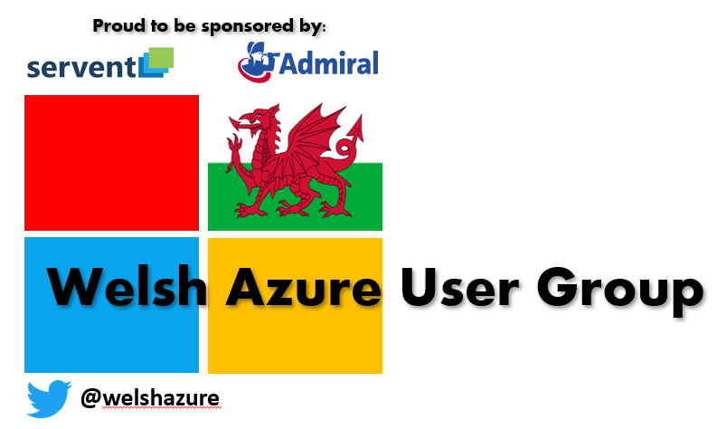

# WAUG-MeetUp 10/09/20

## Side Deck Contains

Intro and Exit Slides

John Lunn - BT Enterprise - Cloud Adoption Framework for Azure

Chris Whitehead - Microsoft - Enterprise Scale

Richard Griffiths - Confused.com - Azure Blueprints

YouTube: [Recorded Session](https://youtu.be/EHjh4IvFE_g) 
Slides: [Download PDF](https://github.com/jonnychipz/WAUG-MeetUp/blob/master/2020-Sept-10/WAUG%20-%20Meetup%20Slides%2010-09-20.pdf) 
BluePrint HTML: [Open HTML](https://github.com/jonnychipz/WAUG-MeetUp/blob/master/2020-Sept-10/WAUG%20-%20Azure%20Blueprints%20Slides%2010-09-20.html) 

#### RSVP - NEXT MEETUP - [RSVP-HERE](https://www.meetup.com/MSFT-Stack/events/272699410/) 12th November 2020

#### Don't forget to follow our socials:  

Twitter: [@welshazure](http://www.twitter.com/welshazure)  
Linkedin: [WAUG](https://www.linkedin.com/groups/13866357/)

